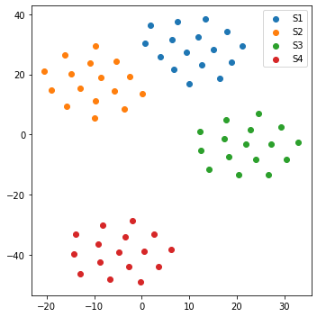
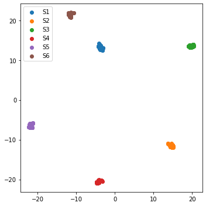
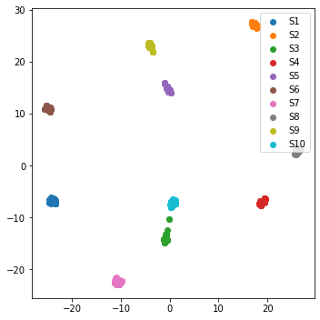

## This is a WIP repo, final version will be released soon


### This repo is an End-to-End pytorch implementation of 
- ```'AUTOVC: Zero-Shot Voice Style Transfer with Only Autoencoder Loss' paper```
- ```'Generalized End-to-End Loss for Speaker Verification' (GE2E loss) paper'```
- **Note**: ```Data used here is very elementary, please prepare you own data to train the model```


### Modules included in this repo
- Voice Embedding Model: model, data, training, and pre-trained model
- GE2E implementation  
- AutoVC Zero-Shot voice style transfer


### Dependencies
- Python 3
- Numpy
- PyTorch
- librosa
- tqdm
- wavenet_vocoder ```pip install wavenet_vocoder```
  for more information, please refer to [this](https://github.com/r9y9/wavenet_vocoder)


### Pre-trained models (soon to be uploaded)

| Embedding Model (GE2E) | AutoVC | WaveNet Vocoder |
|----------------|----------------|----------------|
| [link](https://github.com/gkv856/end2end_auto_voice_conversion/tree/master/static/model_chk_pts/ge2e)| [link](#) | [link](#) |


### Technically there are 7 steps to use this repo
**Steps will be detailed here very soon**

- **Step1** Create spectrogram and train the Speaker Embedding model. Use the code from ```step1_train_embedding_model.py```

  - **Results Step 1 (Embedding model using GE2E loss)**
    - With 4 Speakers
    - With 6 Speakers
    - With 10 Speakers


  

  

  


- **Step2:** Is about training the Auto Voice Clone (AVC Model) 
  - ###### Coming soon

- **Step3:** Is about using AVC model to clone voices
  - ###### Coming soon


### Papers used in this repo
- [Generalized End-to-End Loss for Speaker Verification](https://arxiv.org/abs/1710.10467)
- [AUTOVC: Zero-Shot Voice Style Transfer with Only Autoencoder Loss](https://arxiv.org/abs/1905.05879)

### Inspired from following github repo (BIG THANKS)
- [AutoVC](https://github.com/auspicious3000/autovc)
- [Resemblyzer](https://github.com/resemble-ai/Resemblyzer)


### License

